# MARVEL

MARVEL (MAp Reduce Visual Environment Laboratory) is a prototype system where the user 
is initially provided with a visual representation of a input dataset, encoded as a 
Spark distributed data structure. Moreover, he can choose among a list of standard map and 
reduce functions and apply it on the distributed data structure, playing a graphical animation 
describing the effects of that execution on the same data structure.

## Requirements

MARVEL software is available as a runnable JAR package containing all the dependencies. 
The only requirement needed to run MARVEL is an installation of Java version >= 8.

## Running Example - WordCount

Wordcount is the problem that is generally described to introduce MapReduce to the students 
of a Big Data course. The goal of the problem is counting the number of word occurrences 
contained in an input text. 

Here we show how to solve the problem by applying MapReduce functions into MARVEL, in order to 
introduce the user to the graphical interface and metaphors.

The starting point of the MARVEL execution is the choice of the environment: local or distributed.

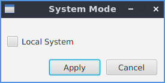

The following sections show the graphical differences between the two modes 
in MARVEL, for the execution of WordCount.

### Local Execution

1. **Configuration Screen**:

After having chosen the system mode (local or distributed), the following screen 
is shown so that the user can select and change the input related parameters. The user
can select an input file and click on the **Generate** button. If no input is specified,
the **Generate** button creates a random input with the value types specified. 

Note that some of the parameters fields are only available when the distributed mode
is selected.

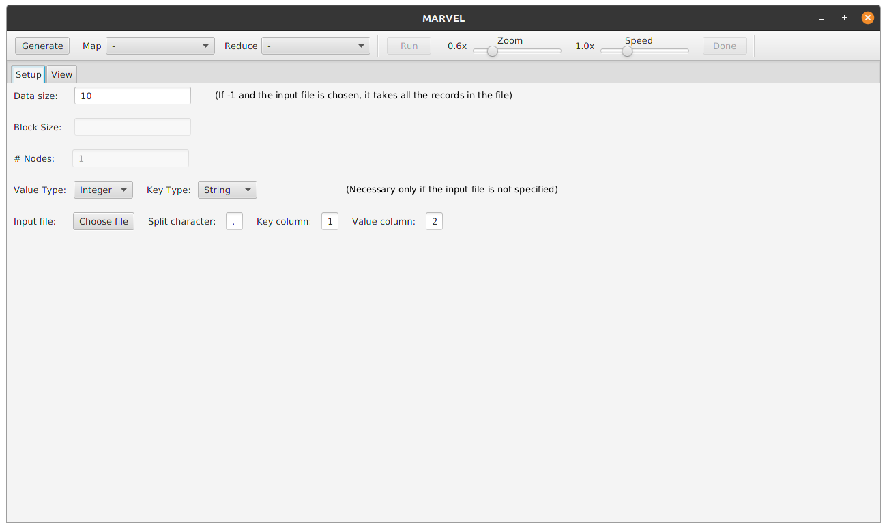

2. **Environment Screen**:

By selecting the local mode, there is no parallel or distributed execution.
The interface shows the input data structure and its content as fields. Upon the
data structure is reported the function applied to have that values. The first data 
structure is idenfied by the *Generate* function.

In this view the user can choose a function to apply among the functions available 
inside the **Map** and **Reduce** drop-down lists. The chosen function is applied 
on the last data structure, by clicking on the **Run** button.

In order to finalize the operation, the **Done** button must be pressed before 
applying an additional operation. Then, an additional item is added to the navigation
bar on the right end of the view. The navigation bar can be used to comment previous 
steps and, eventually, to override or re-run some of them.

The **Zoom** and **Speed** sliders can be useful to, respectively, focus on some points
or slow-down the execution of some operations to better appreciate the effects.

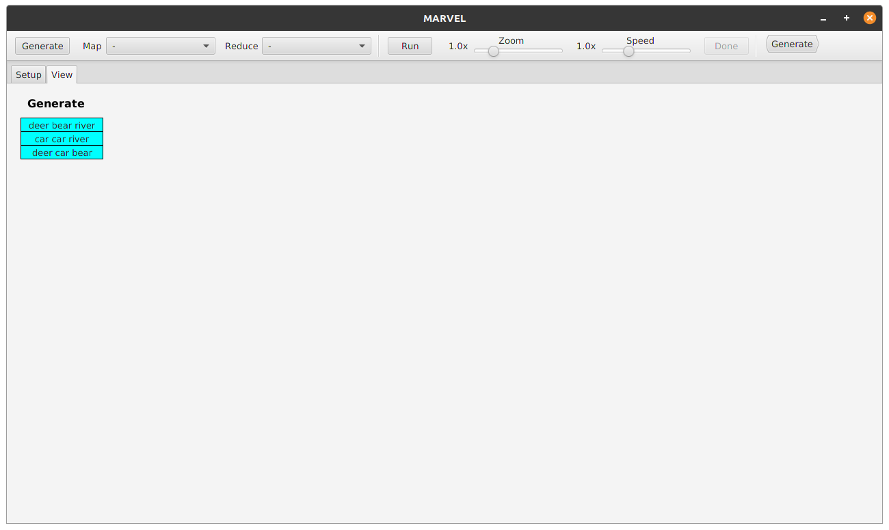

3. **Split Function (Map Transformation)**:

After having described the interface, we can focus on the WordCount problem.

The first step requires to split the fields according to the space character, so that
each line is decomposed by the words contained in it. **MARVEL** makes available a 
**split** transformation that does exactly this job. For each line, the function 
splits it in words and returns a new record for each word, associating it with the 
value 1, often used in lots of tasks.

After having chosen the transformation, the user must click on the **Run** button, then
the animation begins, producing the output data structure.

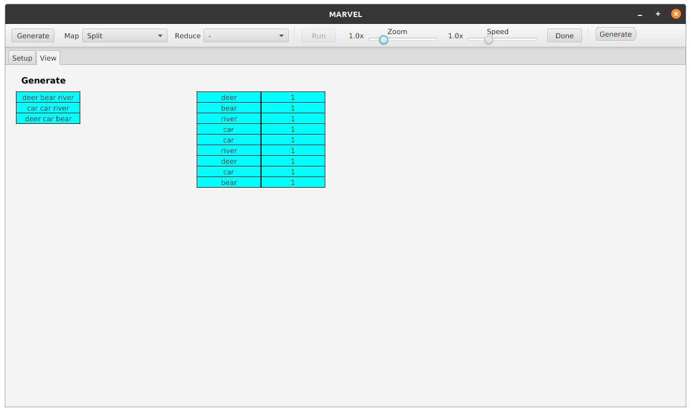

At the end of the animation, the **Done** button is available, as shown in the 
previous figure.

The following figure shows the result of clicking on that button. The *split* label is 
displayed upon the resulting data structure and the *split* item is added to the 
navigation bar on the right.

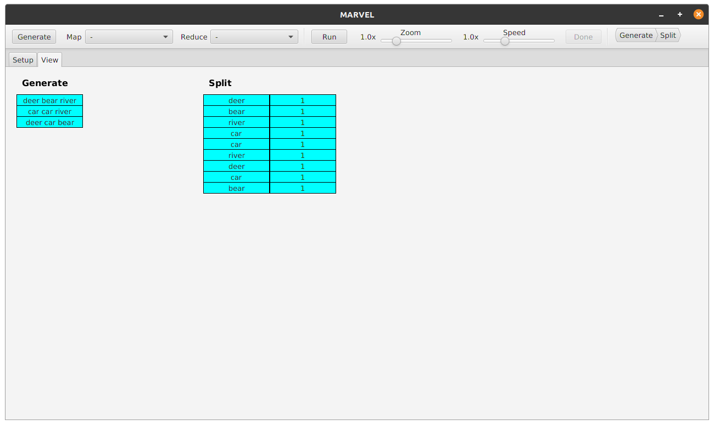

3. **Sum Function (Reduce Transformation)**:

After the map phase, the words have to be counted aggregating them, by summing the
values associated to the same key.

**MARVEL** provides the **ReduceBykey + Sum** function available among the 
*reduce* functions. In this case the last data structure contains no duplicated keys,
since they have been aggregated.

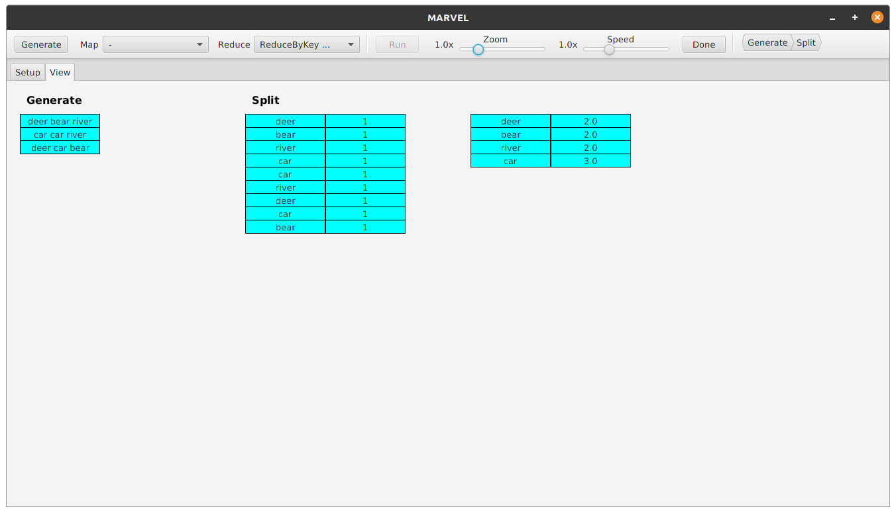

Also in this case the pressure of the **Done** button produces the label upon the 
resulting data struction and the item inside the navigation bar, but the label
color is *red*. This metaphore is used to instruct the user that the performed operation
is expensive in a distributed environment, i.e. involves moving data blocks among the
workers.

In local mode is available a feature that allows to visualize the pipeline of operations
performed to obtain a particular record of the selected data structure. By clicking on 
the record, it is linked to the related records belonging to previous data structure.

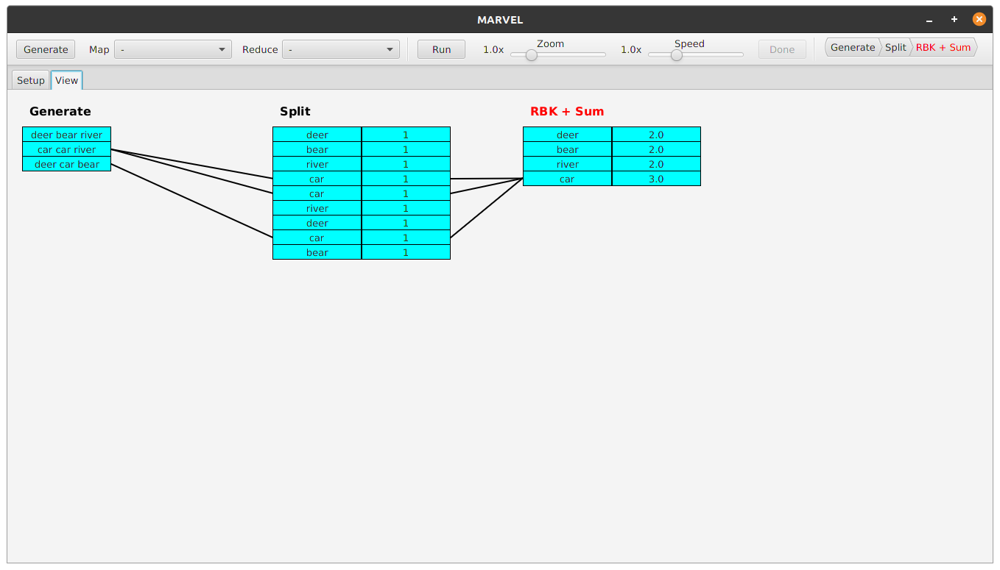

### Distributed Execution

1. **Configuration Screen**:

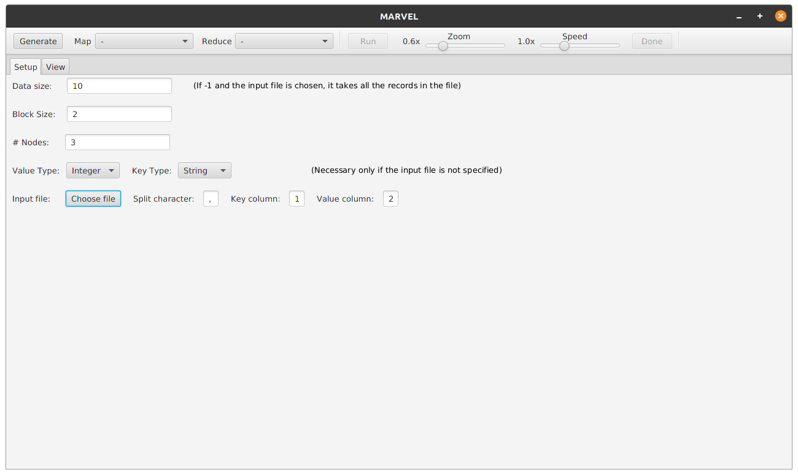

2. **Environment Screen**:

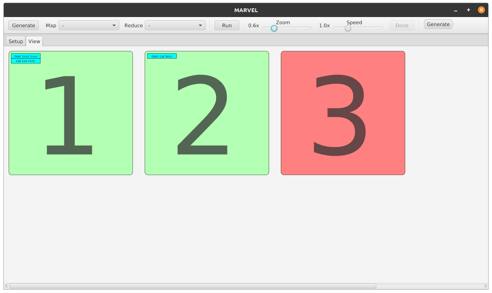

3. **Split Function (Map Transformation)**:

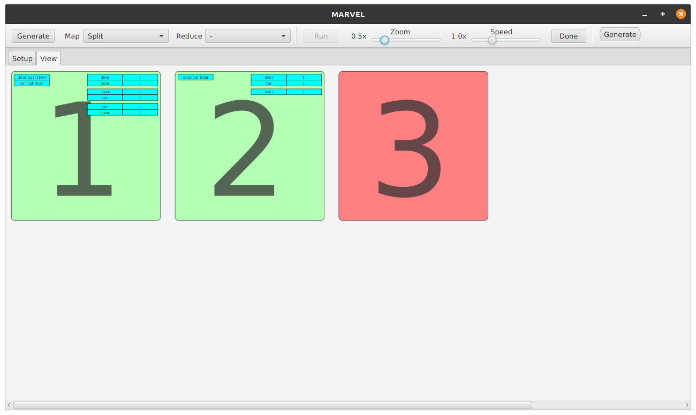
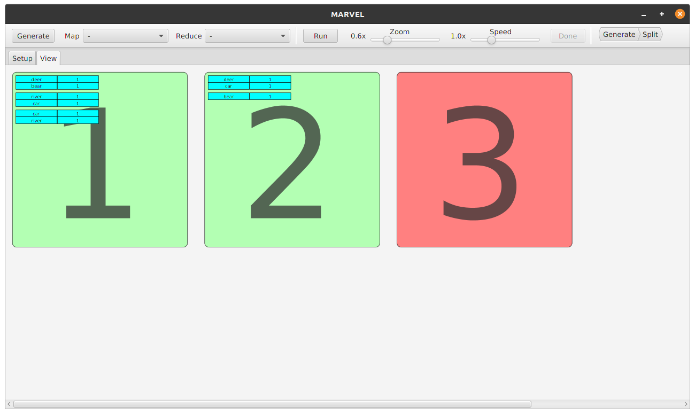

3. **Sum Function (Reduce Transformation)**:

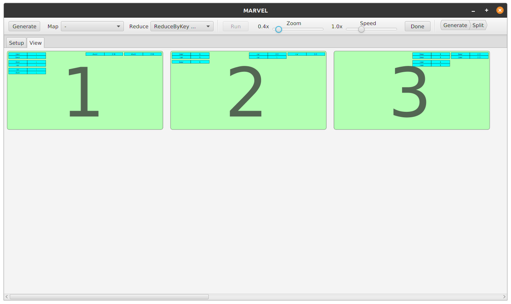
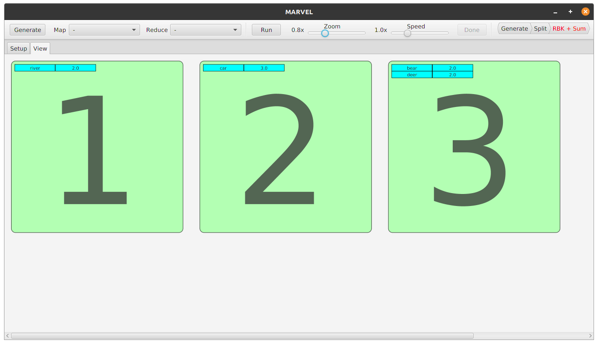