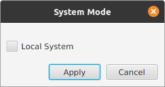

# MARVEL

MARVEL (MAp Reduce Visual Environment Laboratory) is a prototype system where the user 
is initially provided with a visual representation of a input dataset, encoded as a 
Spark distributed data structure. Moreover, he can choose among a list of standard map and 
reduce functions and apply it on the distributed data structure, playing a graphical animation 
describing the effects of that execution on the same data structure.

## Requirements

MARVEL software is available as a runnable JAR package containing all the dependencies. 
The only requirement needed to run MARVEL is an installation of Java version >= 8.

## Running Example - WordCount

Wordcount is the problem that is generally described to introduce MapReduce to the students 
of a Big Data course. The goal of the problem is counting the number of word occurrences 
contained in an input text. 

Here we show how to solve the problem by applying MapReduce functions into MARVEL, in order to 
introduce the user to the graphical interface and metaphors.

The starting point of the MARVEL execution is the choice of the environment: local or distributed.

The following sections show the graphical differences between the two modes 
in MARVEL, for the execution of WordCount.

### Local Execution

1. **Configuration Screen**:

2. **Environment Screen**:

### Distributed Execution

1. **Configuration Screen**:

2. **Environment Screen**:

